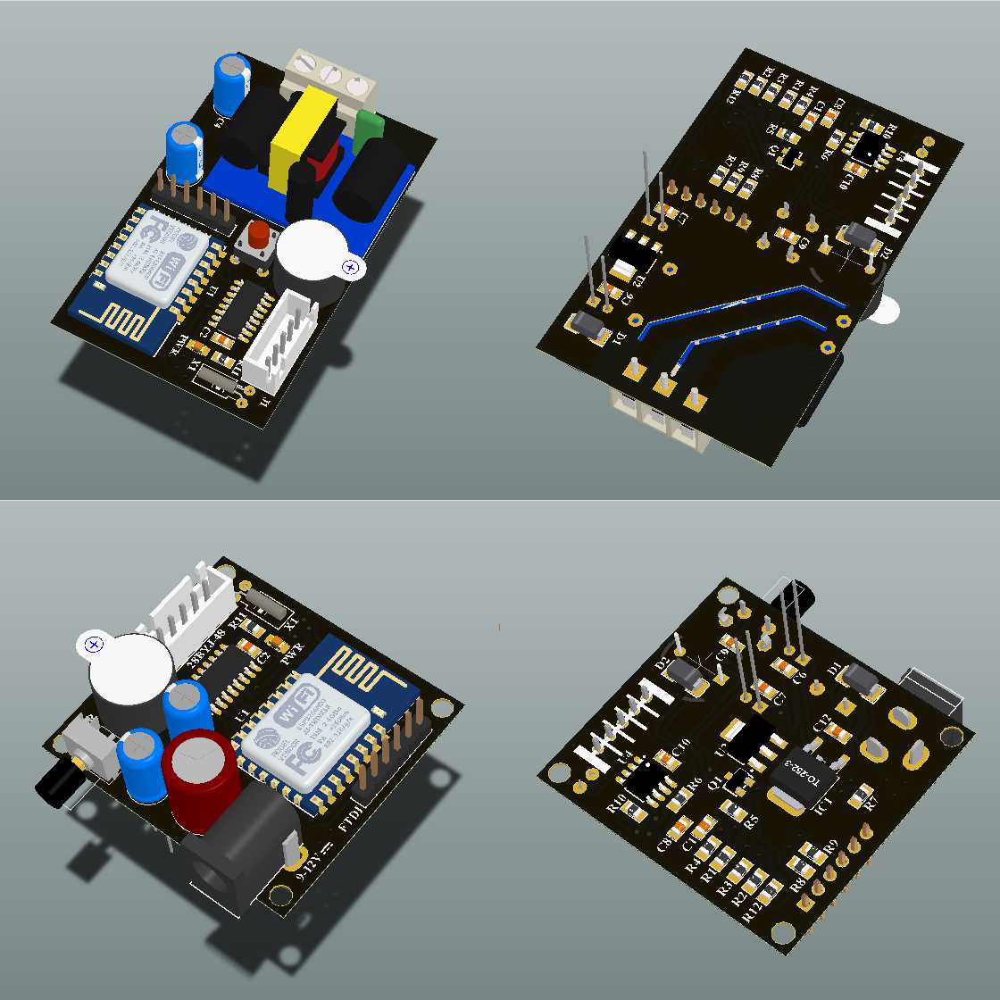
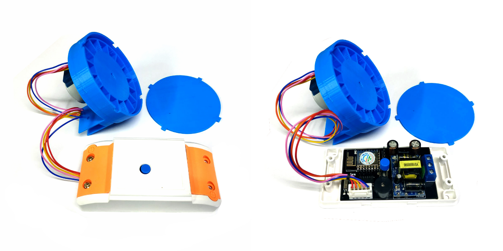
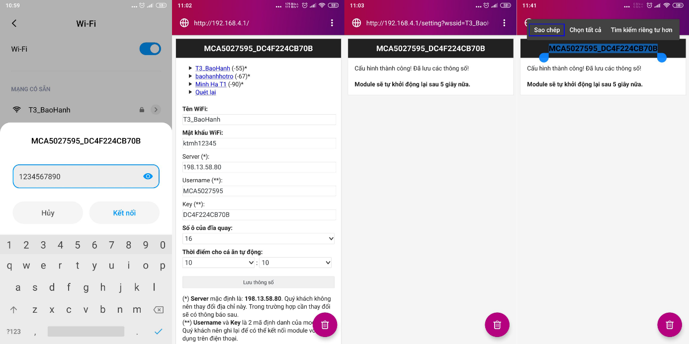
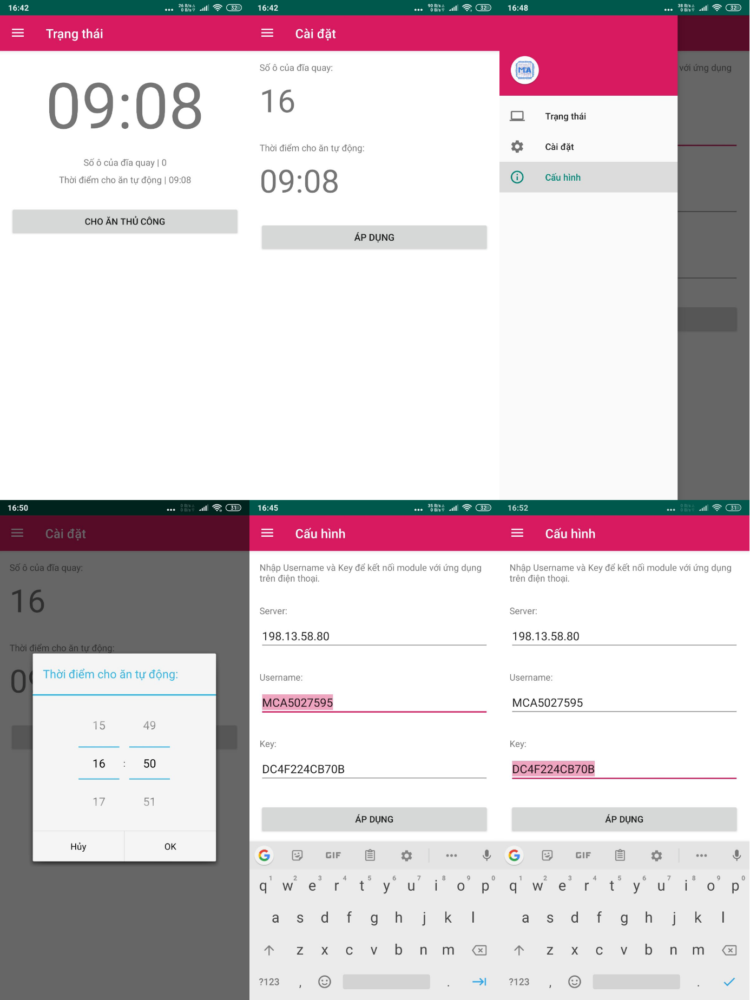

# Mạch cho cá ăn tự động
Mạch cho cá ăn tự động được phát triển dựa trên ESP8266 và Java Android Studio

### Tính năng
- Cho phép cài đặt các thông số bằng ứng dụng android
- Đồng hồ thời gian thực hỗ trợ tự động đồng bộ với thời gian từ Internet
- Nút bấm nhấn giữ nhiều chế độ
- Cấu hình các thông số dễ dàng

### Thông số kỹ thuật
- Điện áp đầu vào: 220VAC/50Hz
- Sử dụng với động cơ bước: 28BYJ-48 5VDC

### Hướng dẫn cấu hình

*(Nếu là lần đầu tiên sử dụng, các bạn nên đọc kỹ hướng dẫn dưới đây!)*

**Bước 1:** Nhấn giữ nút cài đặt cho đến khi còi kêu **3 lần liên tiếp** thì nhả ra, chờ một lúc để module vào chế độ cấu hình thông số.

**Bước 2**: Lúc này module sẽ phát ra một điểm truy cập với tên là **MCAxxxxxxx_xxxxxxxxxxxx**, dùng máy tính hoặc điện thoại kết nối với điểm truy cập ở trên với mật khẩu là **1234567890**.
 
**Bước 3:** Mở trình duyệt có sẵn trên máy tính hoặc điện thoại, các bạn truy cập vào địa chỉ **http://192.168.4.1/** để vào trang cấu hình. 
   
**Bước 4:** Sau khi mở địa chỉ, cấu hình các thông số theo chỉ dẫn sau:

- **Tên WiFi** và **Mật khẩu WiFi** là tên và mật khẩu Wifi để module kết nối. Chú ý, mạng cần có kết nối Internet để đồng bộ thời gian hay để điều khiển thông qua ứng dụng Android
- **Server** là máy chủ để module kết nối đến, mặc định là **198.13.58.80**
- **Username** và **Key** là tên và mã kết nối với ứng dụng Android. Chúng ta cần phải lưu lại hai mã này (Lưu ý: Hai mã này không thể thay đổi được)
- **Số ô của đĩa quay** là số lượng ô có trên đĩa quay, hiện tại bộ khung in chỉ hỗ trợ 16 ô
- **Thời điểm cho cá ăn** là thời gian tự động cho cá ăn

**Bước 5:** Nhấp chọn **Lưu thông số** để hoàn tất quá trình cấu hình, lúc này module sẽ tự động khởi động lại sau 5 giây, hãy nhớ rằng đã sao chép **Username** và **Key** để kết nối với ứng dụng Android.

### Sử dụng ứng dụng Android

*(Nếu là lần đầu tiên sử dụng, các bạn nên đọc kỹ hướng dẫn dưới đây!)*

**Bước 1:** Tải tệp APK và cài đặt ứng dụng vào điện thoại Android của bạn (iOS hiện chưa được hỗ trợ).

**Bước 2:** Mở ứng dụng truy cập vào menu cấu hình. Tại đây chúng ta sẽ điền **Server** là **198.13.58.80**, **Username** và **Key** là hai thông số lưu/sao chép tại bước cấu hình. Sau đó nhấn **Áp dụng** để lưu lại các giá trị.

**Bước 3:** Để áp dụng thay đổi, chúng ta cần tắt hoàn toàn ứng dụng và mở lại. Như vậy chúng ta đã hoàn thành xong các bước cấu hình trên Adroid, tiếp theo chúng ta sẽ đi tìm hiểu cách sử dụng.

**Bước 4:** Menu trạng thái cho chúng ta biết thời gian, số ô của đĩa quay và thời điểm cho cá ăn tự động của bộ điều khiển. Để cho cá ăn thủ công, các bạn nhấp **Cho ăn thủ công**.

**Bước 5**: Menu cài đặt cho phép chúng ta cài đặt thông số chẳng hạn Số ô đĩa quay và thời điểm cho ăn tự động, nhấp chọn vào các nhãn để thay đổi giá trị và nhấn **Áp dụng** để hoàn tất cài đặt.

**Bước 6:** Khi cho ăn thủ công hoặc đến thời điểm cài đặt, động cơ sẽ hoạt động để gạt thức ăn từ các ô vào bể cá.  
